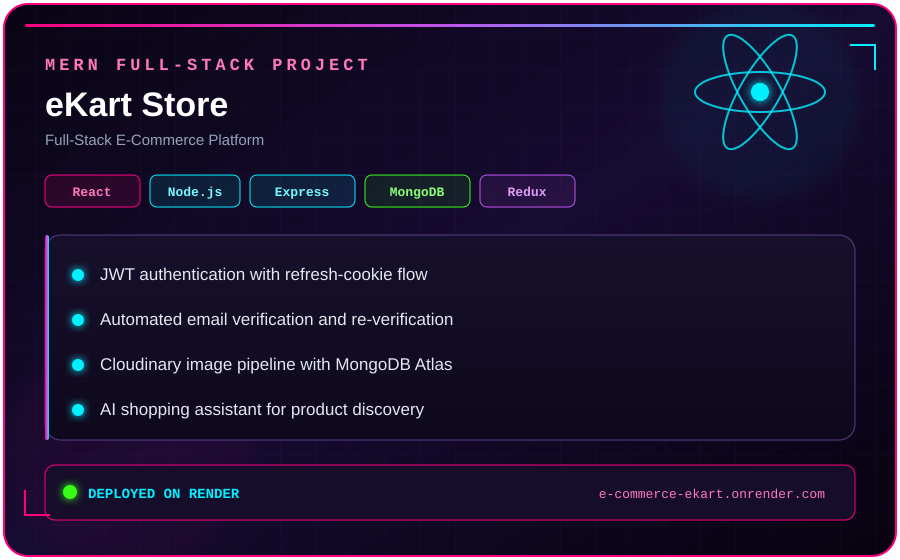
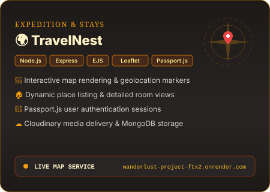
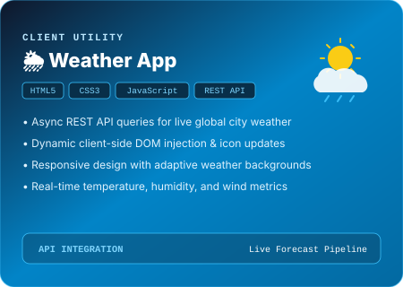
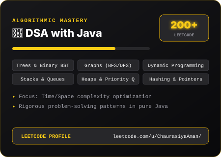

  

  

  
  
  

---

# 🛠️ Tech Stack

### Languages

  

### Frontend

  

### Backend

  

### Database & Cloud

  

### APIs & Authentication

  
  
  

### Tools

  

---

# 🚀 Featured Projects

<table>
<tr>
<td width="50%" valign="middle">

### 🛒 eKart - Full-Stack E-Commerce

A full-stack MERN e-commerce platform with JWT-based authentication, email verification, product management, Cloudinary integration, Redux Toolkit state management, and REST APIs.

**Tech:** React · Node.js · Express · MongoDB · JWT · Redux Toolkit · Cloudinary

 

<b>Live Demo:</b> <a href="https://e-commerce-ekart.onrender.com">eKart</a>

</td>

<td width="50%" align="center" valign="middle">
  
</td>
</tr>

<tr>
<td width="50%" align="center" valign="middle">
  
</td>

<td width="50%" valign="middle">

### 🏡 TravelNest - Travel Listing Platform

A full-stack travel listing platform built with Node.js and Express, featuring user authentication, persistent sessions, image uploads, Cloudinary storage, interactive maps, and MongoDB integration.

**Tech:** Node.js · Express · MongoDB · EJS · Passport.js · Cloudinary · Leaflet

 

<b>Live Demo:</b> <a href="https://wanderlust-project-ftx2.onrender.com/">TravelNest</a>

</td>
</tr>

<tr>
<td width="50%" valign="middle">

### 🌦️ Weather App

A responsive weather application that retrieves real-time weather information through an API and presents the data through a clean, user-friendly interface.

**Tech:** HTML · CSS · JavaScript · Weather API

 

<b>Live Demo:</b> <a href="https://chaurasiya-aman.github.io/weather-app/">Weather App</a>

</td>

<td width="50%" align="center" valign="middle">
  
</td>
</tr>
</table>

---

# 🧠 Data Structures & Algorithms

  

  <b>200+ LeetCode problems solved in Java</b> 
  Graphs · BFS · DFS · Topological Sort · Shortest Paths · Dynamic Programming · Binary Search · Trees

---

# 📚 Computer Science Fundamentals

  
  
  
  
  

---

# 📊 GitHub Statistics

  
  

  

---

# 🐍 Contributions

  <picture>
    <source
      media="(prefers-color-scheme: dark)"
      srcset="https://raw.githubusercontent.com/chaurasiya-aman/chaurasiya-aman/output/github-contribution-grid-snake-dark.svg"
    />
    <source
      media="(prefers-color-scheme: light)"
      srcset="https://raw.githubusercontent.com/chaurasiya-aman/chaurasiya-aman/output/github-contribution-grid-snake.svg"
    />
    
  </picture>

---

# 💡 Developer Quote

  <i>"First, solve the problem. Then, write the code."</i>

---

# 🤝 Connect With Me

   
  

