<!-- header svg -->

  

<!-- About me-->

  

  
  
  

---

# 🛠️ Tech Stack

  

### Languages

### Frontend

### Backend

### Database & Tools

### Backend Technologies

---

# 🚀 Projects

## 🛒 eKart — MERN E-Commerce Platform

A full-stack e-commerce project built with the MERN stack.

**Tech:** React.js • Node.js • Express.js • MongoDB • Redux Toolkit • JWT • Cloudinary

- 🔐 JWT-based authentication with access/refresh cookie handling
- 📧 Email verification and re-verification
- 🖼️ Cloudinary integration for image management
- 🔌 REST API-based backend
- 🤖 AI assistant for product-related interactions
- 🗄️ MongoDB Atlas database
- 🚀 Deployed using Render

🔗 **Live:** https://e-commerce-ekart.onrender.com

---

## 🌍 TravelNest

A full-stack travel/listing application built using Node.js and Express.js.

**Tech:** Node.js • Express.js • MongoDB • EJS • Passport.js • Cloudinary • Leaflet

- 🔐 User authentication
- 🏠 Listing-based functionality
- 🗺️ Interactive maps
- 🖼️ Cloudinary image handling
- 🗄️ MongoDB-based data storage

🔗 **Live:** https://wanderlust-project-ftx2.onrender.com

---

## 🤟 SignBridge

A sign-language translation project currently being developed.

**Tech:** React.js • FastAPI • Python • MediaPipe • TensorFlow

The project focuses on capturing hand gestures through the frontend and processing them through a backend translation pipeline.

🚧 **Currently under development**

---

## 🌦️ Weather Application

A web application that retrieves and displays weather information using an external weather API.

**Tech:** HTML • CSS • JavaScript • REST API

---

# 🧠 Data Structures & Algorithms

I'm actively practicing DSA using **Java**.

Currently working with:

- Arrays & Strings
- Linked Lists
- Stacks & Queues
- Hashing
- Trees
- Graphs
- BFS & DFS
- Heaps & Priority Queues
- Recursion
- Dynamic Programming
- Graph Algorithms

💻 **200+ problems solved on LeetCode**

🔗 https://leetcode.com/u/ChaurasiyaAman/

---

# 📚 Computer Science Fundamentals

- Object-Oriented Programming
- Database Management Systems
- Computer Networks
- Data Structures & Algorithms
- Software Engineering Fundamentals
- MVC Architecture

---

# 📊 GitHub Statistics

  
  

  

---

# 🐍 My Contributions

  <picture>
    <source
      media="(prefers-color-scheme: dark)"
      srcset="https://raw.githubusercontent.com/chaurasiya-aman/chaurasiya-aman/output/github-contribution-grid-snake-dark.svg"
    />
    <source
      media="(prefers-color-scheme: light)"
      srcset="https://raw.githubusercontent.com/chaurasiya-aman/chaurasiya-aman/output/github-contribution-grid-snake.svg"
    />
    
  </picture>

---

# 🏆 GitHub Trophies

  

---

# 💬 Random Dev Quote

  

---

# 🔝 Top Contributed Repository

  

---

# 🤝 Connect With Me

  

  

  

---

  <b>💻 Keep Learning • Keep Building • Keep Solving 🚀</b>

